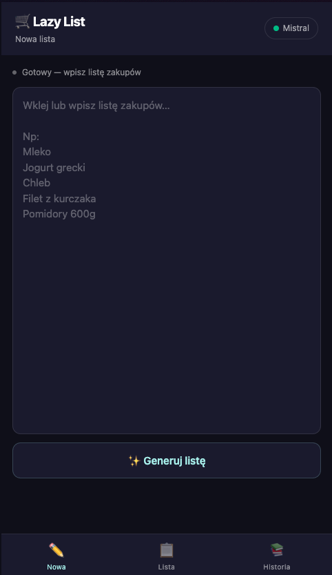
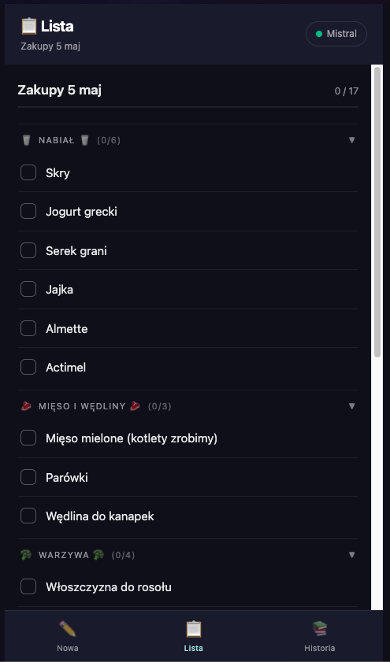

# Lazy List (🍓 the groccery list)

PWA shopping list app that automatically makes your groccery list from plain text and categorizes it. Runs on Cloudflare Workers.




## Stack

- **[Hono](https://hono.dev/)** — server + JSX rendering
- **[HTMX](https://htmx.org/)** — partial HTML swaps
- **[Cloudflare Workers](https://workers.cloudflare.com/)** — edge runtime
- PWA with service worker and installable manifest

## Dev

```sh
pnpm install
pnpm dev
```

## Deploy

Add "run" to avoid pnpm moaning about workspace.

```sh
pnpm run deploy
```
